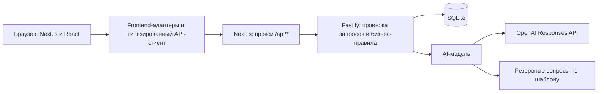

# SkillArena AI · HackAlem

**Платформа, на которой бизнес превращает проблему в понятную задачу, а студенческие команды предлагают решения и получают XP за принятый результат.** Проект команды Magnesium для хакатона HackAlem.

## Проблема и аудитория

Бизнесу бывает сложно описать задачу так, чтобы команда могла приступить к работе: не хватает данных, критериев успеха и ожидаемого результата. Студенческим командам нужны практические задачи с понятными условиями и обратной связью.

SkillArena помогает бизнесу уточнить описание с помощью AI, опубликовать задачу и выбрать исполнителей. Команды находят проекты, отправляют предложения и накапливают подтверждённый прогресс. Текущая версия — работающий MVP с демонстрационными ролями «Бизнес» и «Команда».

## Что реализовано

- **Каталог задач:** поиск, фильтры по теме и готовности, сортировка по рейтингу полноты брифа. Низкий рейтинг не запрещает откликаться.
- **Конструктор задачи:** исходное описание, уточняющие вопросы AI, редактируемая карточка из девяти полей, ручное подтверждение и публикация.
- **Прозрачный рейтинг:** отдельно отображаются предварительный балл, подтверждённый балл черновика и рейтинг опубликованной версии.
- **Черновики и публикации:** сохранение правок в черновике не меняет карточку в каталоге до повторного подтверждения и публикации.
- **Предложения команд:** идея, план, срок и ссылка на прототип; бизнес вручную выбирает или отклоняет предложения, может выбрать несколько команд.
- **Прогресс и XP:** за принятый бизнесом этап начисляется 100 XP. Повторное подтверждение того же этапа не удваивает награду.
- **Демонстрационные команды:** переключение команды в интерфейсе, отдельные отклики и XP. Выбранная команда запоминается в текущей вкладке.
- **Сохранение данных:** задачи, предложения, решения и принятые этапы хранятся на сервере в SQLite и остаются после перезапуска с той же базой.
- **Обработка ошибок:** предупреждение об уходе из несохранённой формы, сравнение конфликтующих версий, сохранение независимых правок, безопасные повторы создания задач и откликов после потери ответа.
- **Резервный режим AI:** при отсутствии ключа или сбое провайдера используются вопросы по шаблону с явной отметкой в интерфейсе.

### Как считается рейтинг

Баллы начисляются за заполненные и подтверждённые сведения. Изменение карточки снимает подтверждение версии.

| Поле                  |   Баллы |
| --------------------- | ------: |
| Контекст              |      10 |
| Потребность           |      10 |
| Данные и материалы    |      20 |
| Ожидаемый результат   |      15 |
| Критерии успеха       |      15 |
| Ограничения           |      10 |
| Пользователи          |      10 |
| Контакт               |       5 |
| Формат взаимодействия |       5 |
| **Всего**             | **100** |

Уровни: **0–39 — черновик**, **40–69 — рабочая**, **70–89 — готовая**, **90–100 — приоритетная**. Здесь «черновик» — также название уровня готовности: опубликованная задача с таким рейтингом доступна командам. Неопубликованные черновики видит бизнес.

Рейтинг отражает полноту описания, а XP — принятые этапы работы команды. Это разные показатели.

## Как работает решение

1. Бизнес вводит описание проблемы, например: «У магазина падают повторные покупки. Нужен анализ причин».
2. Сервер отправляет описание и текущие поля карточки в AI, который возвращает уточняющие вопросы. Без доступного провайдера сервер использует подготовленные вопросы.
3. Бизнес отвечает, редактирует карточку, проверяет сведения и подтверждает публикацию. Сервер рассчитывает рейтинг.
4. Команда находит опубликованную задачу и отправляет свой подход, план, срок и ссылку на прототип.
5. Бизнес рассматривает предложения и вручную выбирает команду или несколько команд.
6. После проверки результата бизнес отдельно принимает этап. Сервер записывает принятие и начисляет XP команде.

AI помогает уточнить задачу; подтверждение сведений, выбор исполнителей и принятие результата остаются за человеком.

## Технологии

| Область                      | Используется в проекте                                                                |
| ---------------------------- | ------------------------------------------------------------------------------------- |
| Язык                         | TypeScript; JavaScript для вспомогательных скриптов; CSS для оформления               |
| Интерфейс                    | Next.js 16.3.6, React 19.3.0, Lucide React                                            |
| Сервер                       | Node.js 24+, Fastify 5                                                                |
| Хранилище                    | SQLite через встроенный модуль `node:sqlite`, режим WAL                               |
| Контракты и документация API | TypeBox, JSON Schema, OpenAPI, Swagger UI                                             |
| AI                           | OpenAI Responses API, структурированный JSON-ответ; модель по умолчанию `gpt-4o-mini` |
| Проверки                     | `node:test`, `node:assert`, TypeScript, `tsx`, интеграционные HTTP-тесты              |
| Инструменты                  | pnpm 11.19.0 для frontend, npm для backend, Prettier, GitHub Actions                  |

Модель и адрес AI-провайдера задаются настройками сервера. Совместимый провайдер должен поддерживать Responses API и структурированные ответы; одной совместимости с Chat Completions недостаточно.

## Архитектура



Браузер обычно обращается к API через тот же адрес, на котором открыт интерфейс. Next.js перенаправляет `/api/*` на Fastify. Сервер проверяет входные данные, версии карточек и демонстрационную принадлежность операций, рассчитывает рейтинг и XP, сохраняет результат в SQLite. Ключ AI используется только сервером.

| Путь                                                | Назначение                                                                              |
| --------------------------------------------------- | --------------------------------------------------------------------------------------- |
| `app/`, `components/`                               | Страницы и компоненты интерфейса                                                        |
| `lib/workspace-api.ts`                              | Операции с сервером, преобразование данных для интерфейса, обработка повторных запросов |
| `lib/brief-api.ts`, `lib/editor.ts`                 | Клиент анализа брифа и объединение изменений карточки                                   |
| `backend/src/app.ts`                                | HTTP-маршруты, валидация, CORS и Swagger                                                |
| `backend/src/service.ts`, `backend/src/rating.ts`   | Бизнес-правила, решения, рейтинг и прогресс                                             |
| `backend/src/store.ts`, `backend/src/seed.ts`       | SQLite и начальные демонстрационные данные                                              |
| `backend/src/ai.ts`                                 | Промпт, схема AI-ответа, вызов провайдера и резервный режим                             |
| `backend/src/contracts.ts`, `backend/src/client.ts` | Общие API-контракты и типизированный клиент                                             |
| `tests/`, `backend/test/`                           | Проверки frontend, API и интеграции                                                     |
| `scripts/dev.mjs`                                   | Совместный локальный запуск двух приложений                                             |

## Установка и запуск

### 1. Подготовьте окружение

Нужны **Git**, **Node.js 24 или новее** с npm и **pnpm 11.19.0**.

```bash
node --version
npm install -g pnpm@11.19.0
```

### 2. Получите проект и установите зависимости

```bash
git clone https://github.com/BAITC-Hacks/hack-fe7f2d61-magnesium.git
cd hack-fe7f2d61-magnesium
pnpm setup
```

Если проект уже скачан, перейдите в его корневую папку и выполните `pnpm setup`. Команда запускает `pnpm install --frozen-lockfile` и `npm ci --prefix backend`.

### 3. При необходимости подключите настоящий AI

**Для запуска без внешнего AI настройки не обязательны:** приложение работает с демо-вопросами.

Чтобы включить провайдера, скопируйте `backend/.env.example` в `backend/.env` (если своего файла ещё нет):

```bash
cp backend/.env.example backend/.env
```

В PowerShell используйте `Copy-Item backend/.env.example backend/.env`. В новом файле задайте `OPENAI_API_KEY`; модель по умолчанию — `gpt-4o-mini`. Не заменяйте уже настроенный `.env` и не публикуйте ключ в репозитории или переменных `NEXT_PUBLIC_*`.

Основные настройки backend:

| Переменная        | Значение по умолчанию / назначение                                                |
| ----------------- | --------------------------------------------------------------------------------- |
| `OPENAI_API_KEY`  | Не задана; без ключа используются демо-вопросы                                    |
| `OPENAI_MODEL`    | `gpt-4o-mini`                                                                     |
| `OPENAI_BASE_URL` | `https://api.openai.com/v1`                                                       |
| `AI_TIMEOUT_MS`   | `12000` — время ожидания AI-ответа в миллисекундах                                |
| `DATABASE_PATH`   | `./data/skillarena.sqlite`, относительно рабочего каталога backend                |
| `SEED_DEMO`       | `true` — создание начальных примеров при первом запуске базы                      |
| `HOST` / `PORT`   | `127.0.0.1` / `3001` для отдельного запуска API                                   |
| `CORS_ORIGINS`    | Разрешённые адреса frontend при прямых запросах к API; см. `backend/.env.example` |

### 4. Запустите оба приложения

Из корня репозитория:

```bash
pnpm dev
```

- Интерфейс: [http://127.0.0.1:3000](http://127.0.0.1:3000).
- Проверка API: [http://127.0.0.1:3001/api/health](http://127.0.0.1:3001/api/health).
- Интерактивная документация API: [http://127.0.0.1:3001/docs/](http://127.0.0.1:3001/docs/).

Оставьте терминал открытым. **Ctrl+C** останавливает оба сервиса. После обновления исходников перед показом перезапустите приложение, чтобы не использовать старый сервер.

Если порты заняты, остановите предыдущий экземпляр или выберите другие порты. В macOS/Linux:

```bash
FRONTEND_PORT=3100 BACKEND_PORT=3101 pnpm dev
```

В PowerShell:

```powershell
$env:FRONTEND_PORT='3100'
$env:BACKEND_PORT='3101'
pnpm dev
```

В этом случае интерфейс открывается на `http://127.0.0.1:3100`. Общий запуск использует `BACKEND_PORT` для API и автоматически настраивает прокси.

### Сборка и запуск собранной версии

```bash
pnpm build:all
```

Затем в двух терминалах из корня проекта:

```bash
# Терминал 1
npm start --prefix backend
```

```bash
# Терминал 2
pnpm start
```

Если API находится по другому адресу, задайте `BACKEND_URL` при сборке Next.js; пример настройки есть в [.env.example](.env.example). Для стандартного локального запуска frontend-переменные не нужны. `npm start --prefix backend` использует собранный каталог `backend/dist`, поэтому после изменения серверного кода требуется новая сборка.

## Как проверить решение: сценарий для жюри

Сценарий занимает около 5 минут. Достаточно одного браузера: роли переключаются в интерфейсе. На существующей базе XP могут быть уже начислены — запомните начальное значение выбранной команды.

| Шаг | Действие                                                                                                                           | Ожидаемый результат                                                                       |
| --- | ---------------------------------------------------------------------------------------------------------------------------------- | ----------------------------------------------------------------------------------------- |
| 1   | Откройте каталог, измените поиск или фильтр готовности                                                                             | Список задач обновляется; задача с низким рейтингом остаётся доступной для отклика        |
| 2   | Нажмите «Я представляю бизнес» → «Подставить»                                                                                      | В форме появляется пример исходной проблемы                                               |
| 3   | Нажмите «Улучшить задачу с AI»                                                                                                     | Появятся уточняющие вопросы; интерфейс явно покажет ответ модели или демо-режим           |
| 4   | Ответьте на вопросы либо используйте «Заполнить ответами из демо-примера», если кнопка доступна; нажмите «Собрать карточку»        | Откроется редактируемая карточка; задайте уникальное название и заполните оставшиеся поля |
| 5   | Проверьте девять полей, поставьте галочку подтверждения и нажмите «Опубликовать задачу»                                            | Карточка появится в каталоге; при заполнении и подтверждении всех полей рейтинг равен 100 |
| 6   | Переключитесь на «Команда», выберите Data Nomads, откройте свою задачу → «Предложить решение»; заполните демо-примером и отправьте | Предложение поступит бизнесу на рассмотрение; XP ещё не изменятся                         |
| 7   | В «Кабинете бизнеса» откройте задачу и нажмите «Выбрать команду»                                                                   | Предложение отмечено выбранным; XP пока не начислены                                      |
| 8   | Для демонстрации представьте, что результат сдан: «Подтвердить этап» → «Да, результат принят»                                      | Выбранная команда получит +100 XP за принятый этап                                        |
| 9   | Переключитесь обратно на Data Nomads, откройте «Моя команда» и обновите страницу                                                   | Принятый этап и XP сохранятся; повторное принятие того же этапа недоступно                |

В live-режиме вопросы могут меняться. Статус «AI · готов к запросу» означает только наличие ключа; успешный вызов подтверждают «AI · ответ получен» и «AI-АНАЛИЗ». Если показаны «Демо-вопросы», используется резервный режим — это не ответ внешней модели.

Дополнительно можно изменить опубликованную задачу и сохранить черновик: каталог сохранит прежнюю публикацию. При редактировании одной карточки в двух вкладках устаревшее сохранение вызовет сравнение версий, позволяющее выбрать нужный текст.

Подробный сценарий: [docs/DEMO.md](docs/DEMO.md).

### Автоматические проверки

```bash
pnpm check       # тесты frontend, backend, HTTP-интеграция и проверка TypeScript
pnpm build:all   # production-сборки обоих приложений
```

Тесты используют отдельные тестовые хранилища и не затрагивают пользовательскую базу. Они проверяют рейтинг, публикации и черновики, конфликты версий, ручной выбор, однократное начисление XP, повторы запросов и обработку AI-ответов. Эти команды также выполняются в GitHub Actions для `main`, `frontend`, `backend` и Pull Request.

Результаты предыдущих проверок и границы ручного тестирования записаны в [docs/QA.md](docs/QA.md).

## Данные и интеграции

- **Демонстрационные данные** создаются из [backend/src/seed.ts](backend/src/seed.ts): 5 опубликованных задач, 5 отдельных черновиков, 5 команд и 5 предложений. Примеры синтетические, а ссылки `example.test` — демонстрационные адреса. Упомянутые в карточках CSV и материалы не загружаются из внешних источников.
- **Пользовательские данные** вводятся в интерфейсе и сохраняются в `backend/data/skillarena.sqlite` при стандартном запуске. Начальное заполнение не повторяется при каждом перезапуске той же базы.
- **OpenAI** — необязательная внешняя интеграция. При настроенном ключе сервер отправляет описание и поля брифа провайдеру через Responses API с `store: false`. Для запроса нужен интернет; без него сервер может перейти к демо-вопросам. Собственное обучение модели в проекте не реализовано.
- **Собственный REST API** обслуживает каталог, черновики, команды, предложения, принятие этапов и анализ брифа. Контракт: [backend/openapi.json](backend/openapi.json); описание: [backend/README.md](backend/README.md).
- **Ссылки на прототипы** сохраняются как часть предложения. Их наличие не означает автоматическую проверку работоспособности прототипа.

## Ограничения текущей версии

- Нет регистрации и полноценной авторизации. Переключение ролей и заголовки `X-Business-Id` / `X-Team-Id` служат демонстрационными идентификаторами. Это не защита для публичной эксплуатации.
- Принятие результата выполняет бизнес вручную. AI не назначает команды, не проверяет качество прототипа и не выдаёт XP самостоятельно. Рейтинг полноты не гарантирует достоверность сведений или качество выполненной работы.
- В интерфейсе используется один демонстрационный принимаемый этап на предложение; полноценное управление многоэтапным проектом не реализовано.
- Нет мгновенных серверных push-обновлений: данные перечитываются, в том числе при возврате фокуса на страницу.
- Несохранённый текст защищён предупреждением, но не записывается в постоянное хранилище браузера. Старые данные локального frontend-демо автоматически не импортируются.
- Для размещения backend нужен постоянный диск под SQLite. Текущий вариант рассчитан на один экземпляр сервиса, а не на эфемерные serverless-функции или распределённое развёртывание.
- Демо-режим AI использует шаблоны. Доступность настоящей модели зависит от ключа, сети и провайдера.

## Развёрнутая версия

**Подтверждённая ссылка на публичную deployed-версию в репозитории не указана.** Для проверки используйте локальный запуск по инструкции выше. Адрес `http://127.0.0.1:3000` доступен на компьютере, где запущен проект, и не является публичным демо.

## Документация для команды

- [Правила веток и слияния](BRANCH_RULES.md).
- [API, настройки и запуск backend](backend/README.md).
- [Контракт интеграции frontend и backend](docs/frontend-integration.md).
- [Сценарий демонстрации](docs/DEMO.md).
- [Результаты проверок](docs/QA.md).
